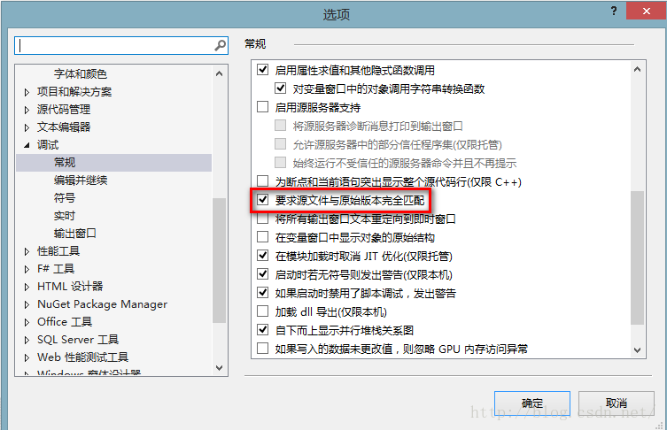

## 当前不会命中断点还未为文档加载任何符号

断点调试是VS中的一大利器，有了它我们可以快速定位到代码的问题所在。在某些情况下会导致设置了断点后程序无法在断点处停下，下面分4种情况来解决断点不会命中的问题：

        1、检查VS的调试模式。VS的调试分为两种，Debug和Release。Debug是专门真对检查程序的bug而设置的一种模式。Release模式对程序的编译进行了优化，一般用于程序发布。首先确保是在Debug模式下设置的断点。

        2、检查设置断点的模块在调试时有没有输出。调试时遇到最多的警告“当前不会命中断点 还没有为该文档加载任何符号 ”。原因是我们设置断点的代码块并没有编译输出。找到程序的生成目录，通常是在bin文件夹下，删除设置断点代码文件对应的dll文件或exe文件。重新调试项目。

       3、统一引用目录，将引用设置到同一个目录下，防止源码与dll版本不匹配

       4、工具——选项——调试——常规中的“要求源文件和原始版本完全匹配”的勾去掉

