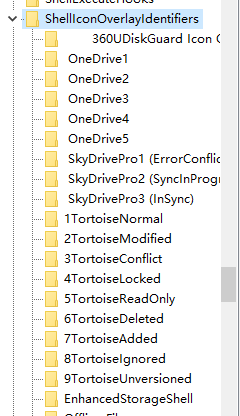

## SVN {#svn}

### 图标不显示解决办法

http://blog.csdn.net/xb12369/article/details/53782137

SVN的图标的排位顺序排在下面去了，导致其它图标占用了它的位置，也就是需要把Tortoise的位置提到上面来

解决办法：

①win+R，输入regedit进入注册表

②ctrl+f搜索ShellIconOverlayIdentifiers（这里需要一会时间，耐心等待就是的）

**注册表无法搜索的时候请看这里：**[http://blog.csdn.net/xb12369/article/details/70849200](http://blog.csdn.net/xb12369/article/details/70849200)

HKEY_LOCAL_MACHINE-&gt;SOFTWARE-&gt;Microsoft-&gt;Windows-&gt;CurrentVersion-&gt;Explorer-&gt;ShellIconOverlayIdentifiers

③将Tortoise 1~9的前面价格空格（F2重命名，+个空格）