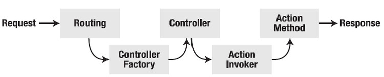

## MVC编程模式 {#mvc}

本此项目使用MVC编程模式

MVC 是三种 ASP.NET 编程模式中的一种。其它两种为Web Pages（Web 页面）、Web Forms（Web 窗体）。

MVC 是一种使用 MVC（Model View Controller 模型-视图-控制器）设计创建 Web 应用程序的模式：

Model（模型）表示应用程序核心（比如数据库记录列表）。

View（视图）显示数据（数据库记录）。

Controller（控制器）处理输入（写入数据库记录）。

MVC 模式同时提供了对 HTML、CSS 和 JavaScript 的完全控制。

[http://www.cnblogs.com/DotCpp/p/3269043.html](http://www.cnblogs.com/DotCpp/p/3269043.html)

ASP.NET MVC由以下两个核心组成部分构成：

一个名为UrlRoutingModule的自定义HttpModule，用来解析Controller与Action名称；

[https://msdn.microsoft.com/zh-cn/library/system.web.routing.urlroutingmodule.aspx](https://msdn.microsoft.com/zh-cn/library/system.web.routing.urlroutingmodule.aspx)

[http://referencesource.microsoft.com/\#System.Web/Routing/UrlRoutingModule.cs,9b4115ad16e4f4a1](http://referencesource.microsoft.com/#System.Web/Routing/UrlRoutingModule.cs,9b4115ad16e4f4a1)

一个名为MvcHandler的自定义HttpHandler，用来实现对Controller的激活和Action的执行；

整个ASP.NET MVC系统的路由信息全部存放在RoteTable这个类的静态变量Routes（为一个RouteDictionary类型）中，网站开始运行时，在Application\_Start中对路由进行注册：RouteTable.Routes.Add\("default", new Route{Url="{controller}/{action}"}\);

当一个URL请求到来时，被UrlRoutingModule拦截，拦截后执行流程如下：

封装当前http上下文，变为HttpContextWrapper对象。

根据当前的http上下文，从Routes中得到与当前请求URL相符合的RouteData对象。该对象存储有RouteHandler信息。

把RouteData与http上下文请求封装成一个RequestContext对象。

根据RequestContext对象，从RouteData的RouteHandler中获取IHttpHandler。

执行IHttpHandler，进行请求的真正处理。

UrlRoutingModule的代码如下：

HttpContextWrapper httpContext = new HttpContextWrapper\(HttpContext.Current\);

RouteData routeData = RouteTable.Routes.GetRouteData\(httpContext\);

RequestContext requestContext = new RequestContext{ data = routeData, context= httpContext};

IHttpHandler handler = routeData.RouteHandler.GetHttpHandler\(requestContext\);

httpContext.RemapHandler\(handler\);

经过上面最后一步，执行HttpHandle后，程序正式进入Controller激活里面，相关类关系如下图所示：

同URL路由一样，MVC初始化时，也需要注册控制器的一些信息，这里是要让框架知道默认的控制器工厂是什么，所以在Application\_Start中：

ControllerBuilder.Current.SetControllerFactory\(new DefaultControllerFactory\(\)\);

程序通过上面的URL路由转换后，进入HttpHandle中，经过以下步骤实现对Controller的激活：

从Requestcontext封装的RouteData中得到Controller名字。

通过ControllerBuilder得到当前默认的Controller工厂。

根据Controller的名字，创建控制器对象（在ControllerFactory初始化的时候，会扫描整个程序集中所有实现IController接口的控制器类型，所以当调用CreateController时，实际上是直接获取）。

最后执行控制器。执行的实质其实就是执行ActionInvoker.InvokeAction，即根据请求上下文执行相应的Action。

在自定义的MvcHandler中，代码如下：

string controllerName =this.Requestcontext.RouteData.Controller;

IControllerFactory factory = ControllerBuilder.Current.GetControllerFactory\(\);//通过controllerName得到Control\(如HomeController\)

IController controller = controllerFactory.CreateController\(this.RequestContext,controllerName\);

controller.Execute\(this.RequestContext\);

一个典型的IActionInvoker接口实现ControllerActionInvoker的InvokeAction方法如下：

public void InvokeAction\(ControllerContext controllerContext,

string actionName\)

{

//找到Action方法

MethodInfo method = controllerContext.Controller.GetType\(\).GetMethods\(\)

.First\(m=&gt;string.Compare\(actionName,m.Name,true\)==0\);

//获取Action参数，并进行Model绑定

List&lt;object&gt; parameters = new List&lt;object&gt;\(\);

foreach\(ParameterInfo parameter in method.GetParameters\(\)\)

{

parameters.Add\(this.ModelBinder.BindModel\(controllerContext,

parameter.Name, parameter.ParameterType\)\);

}

//执行Action，并得到ActionResult

ActionResult actionResult = method.Invoke\(controllerContext.Controller,

parameters.ToArray\(\)\) as ActionResult;

//最终ActionResult用HttpResponse将数据传回客户进行显示

actionResult.ExecuteResult\(controllerContext\);

}

最终形成一个Http Response传回到客户端！！

也可以创建自定义路由（参考网上资料）

###  {#mvc-0}

### Asp.Net MVC 控制器 {#asp-net-mvc}

MVC控制器负责响应对ASP.NET MVC网站发起的请求。每一个浏览器请求都映射到了一个专门的控制器。举个例子，设想一下你在浏览器地址栏输入了下面的URL：

[http://localhost/product/index/3](http://localhost/product/index/3)

在这种情况下，将会调用一个名为ProductController的控制器。ProductController负责生成对浏览器请求的响应。举个例子，控制器可能会返回一个特定的视图，或者是将用户重定向到另一个控制器。

你可以通过在ASP.NET MVC应用程序的Controllers文件夹下添加一个新的控制器来创建一个新控制器。右键点击控制器的文件夹，并且选择菜单项“Add（添加）”，“New（新建项）”，并选择“MVC Controller Class（MVC控制器类）”（见图1）。控制器的名字必须含有Controller后缀。举个例子，控制器名称ProductController没什么问题，但是控制器Product就不起作用。

控制器不过是一个类（Visual Basic.Net 或者是C\#类）。一个控制器是一个继承自System.Web.Mvc.Controller基类的类。因为控制器继承自这个基类，所以控制器轻松地继承了一些有用的方法（我们不久将会讨论这些方法）。

**理解控制器动作**

控制器暴露出控制器动作。动作是控制器的一个方法，当你在浏览器地址栏输入某一特定的URL时，将会调用这个方法。举个例子，假设你对下面这个URL发出请求：

[http://localhost/Product/Index/3](http://localhost/Product/Index/3)

在本例中，Index\(\)方法在ProductController类上被调用。Index\(\)方法是控制器动作的一个例子。

一个控制器动作必须是控制器类的一个公共方法。C\#方法，默认时，是私有方法。意识到你添加到控制器类中的任何公共方法都会自动被暴露为控制器动作（你必须非常小心，因为控制器动作可以被全球的任何人调用，仅仅简单地通过在浏览器地址栏输入正确的URL）。

控制器动作还要满足一些额外的需求。作为控制器动作来使用的方法不能够重载。另外，控制器动作不能为静态方法。除了这些以外，你可以将任何方法作为控制器动作来使用。

** 理解控制器结果**

控制器动作返回一种叫做**动作结果**（Action Result）的东西。动作结果是控制器动作返回给浏览器请求的东西。

ASP.NET MVC框架支持六种标准类型的动作结果：

1. ViewResult – 代表HTML及标记。
2. EmptyResult – 代表无结果。
3. RedirectResult – 代表重定向到一个新的URL。
4. RedirectToRouteResult – 代表重定向到一个新的控制器动作。
5. JsonResult – 代表一个JSON（Javascript Object Notation）结果，它可以用于AJAX应用程序。
6. ContentResult – 代表着文本结果。

所有这些动作结果都继承自ActionResult基类。

在大多数情况下，控制器动作 ViewResult

using System;using System.Collections.Generic;using System.Linq;using System.Web;using System.Web.Mvc;namespace MvcApp.Controllers{     public class BookController : Controller     {          public ActionResult Index\(\)          {               return View\(\);          }     }}

当一个动作返回一个ViewResult，将会向浏览器返回HTML。代码清单2中的Index\(\)方法向浏览器返回了一个名为Index.aspx的视图。（或Index.cshtml）

注意到代码清单2中的Index\(\)动作并没有放回一个ViewResult\(\)。而是调用了Controller基类的View\(\)方法。通常情况下，你并不直接返回一个动作结果。而是调用Controller基类的下列方法之一：

1. View – 返回一个ViewResult结果。
2. Redirect – 返回一个RedirectResult 动作结果。
3. RedirectToAction – 返回一个RedirectToAction动作结果。
4. RedirectToRoute – 返回一个RedirectToRoute动作结果。
5. Json – 返回一个JsonResult动作结果。
6. Content – 返回一个ContentResult动作结果。

因此，如果你想向浏览器返回一个视图，你可以调用View\(\)方法。如果你想要降用户从一个控制器动作重定向到另一个，你可以调用RedirectToAction\(\)方法。举个例子，代码清单3中的Details\(\)动作要么显示一个视图，要么将用户重定向到Index\(\)动作，取决于Id参数是否含有值。

using System;using System.Collections.Generic;using System.Linq;using System.Web;using System.Web.Mvc;namespace MvcApp.Controllers{     public class CustomerController : Controller     {          public ActionResult Details\(int? Id\)          {               if \(Id == null\)                    return RedirectToAction\("Index"\);               return View\(\);          }          public ActionResult Index\(\)          {               return View\(\);          }     }}

ContentResult动作结果很特别。你可以使用ContentResult动作结果来将动作结果作为纯文本返回。举个例子，代码清单4中的Index\(\)方法将消息作为了纯文本返回，而不是HTML。

如果一个控制器动作返回了一个结果，而这个结果并非一个动作结果 – 例如，一个日期或者整数 – 那么结果将自动被包装在ContentResult中。举个例子，当调用代码清单5中的WorkController的Index\(\)动作时，日期将自动作为一个ContentResult返回。

### Asp.Net MVC 视图 {#asp-net-mvc-0}

**理解视图**

ASP.NET MVC与ASP.NET或者动态服务器页（ASP）不同，它并没有任何直接对应于一个页面的东西。在ASP.NET MVC应用程序中，磁盘上并没有一个页面来对应你在浏览器地址栏中输入的URL路径。在ASP.NET MVC应用程序中，最接近页面的东西是称为视图（View）的东西。

在ASP.NET MVC应用程序中，即将到达的浏览器请求被映射到了控制器动作。一个控制器动作可能会返回一个视图。然而，一个控制器动作可能执行某种类型的操作，例如将你重定向到另一个控制器动作。

代码清单1含有一个简单的控制器，叫做HomeController。HomeController暴露出了两个控制器动作，叫做Index\(\)和Details\(\)。

你可以通过在浏览器的地址栏输入下面的URL，调用第一个动作，Index\(\)动作：

/Home/Index

你可以通过在浏览器中输入这个地址，来调用第二个动作，Details\(\)动作：

/Home/Details

Index\(\)动作返回一个视图。你所创建的大多数动作都将返回一个视图，然而，动作可以返回任何类型的动作结果。例如，Details\(\)动作返回了一个RedirectToActionResult，它可以将即将到达的请求重定向到Index\(\)动作。

Index\(\)动作包含了下面一行代码：

return View\(\);

这行的代码返回了一个视图，该视图在服务器上的路径必须和下面的路径一样：

\Views\Home\Index.aspx

视图的路径由控制器和控制器动作的名称推断得出。

如果你愿意，可以显式地指明视图。下面一行代码返回了一个视图，名为“Fred”：

return View\("Fred"\);

当执行这行代码时，将会从下面的路径返回一个视图：

\Views\Home\Fred.aspx

**创建一个视图**

你可以在解决方案浏览器中的文件夹上点击右键，并且选择菜单项“Add（添加）”、“New Item（新建项）”（如图1）。选择“MVC View Page”模板将标准视图添加到你的项目中。

应该意识到你不能像ASP.NET或者ASP应用程序中那样，随意向项目中添加视图。你必须将视图添加到文件夹中，并且该文件夹的名称与控制器的名称相同（不含Controller后缀）。举个例子，如果你想创建一个新的、叫做Index的视图，该视图可以由名为ProductController的控制器返回，那么你必须添加这个视图到项目的如下文件夹中：

\Views\Product\Index.aspx

含有视图的文件夹的名称必须与返回该视图的控制器的名称相对应。

